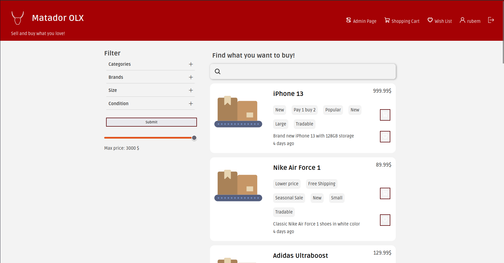
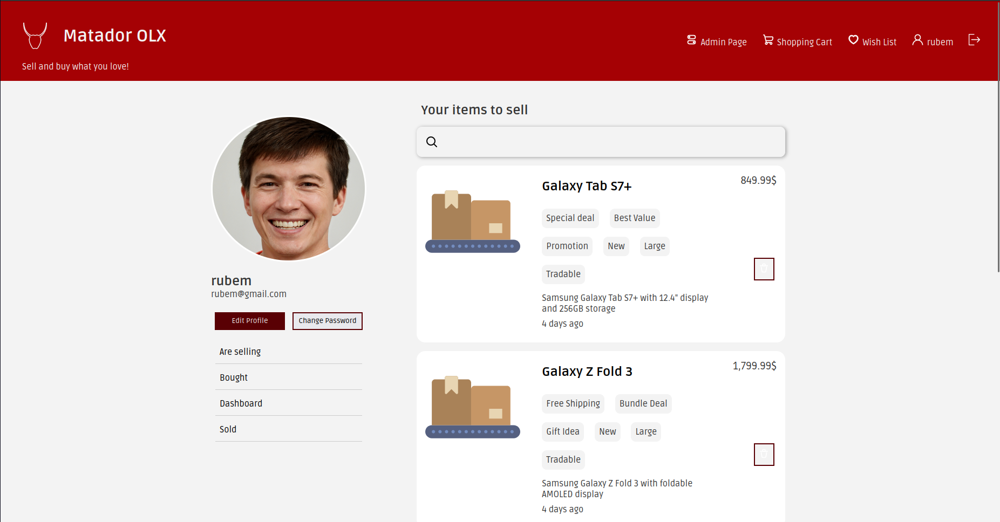

# Matador OLX

### Contributors and Grade

* [Mansur Mustafin](https://github.com/Mansur-Mustafin)
* [Rubem Neto](https://github.com/rubuy-74)
* [Bruno](https://github.com/BrunoM6)

Grade: 19.4/20

## Install Instructions

1. **Clone the Repository**: `git clone git@github.com:FEUP-LTW-2024/ltw-project-2024-ltw06g04.git` or downloar zip and unpack it.
2. **Navigate to the Project Directory**: `cd ltw-project-2024-ltw06g04`
3. **Refresh the Database**: `./refresh`
4. **Run Locally**: `php -S localhost:9000`

Below is a table outlining the credentials required to access the system:

| Username | Password |
|----------|----------|
| Mansur   | qwerty123|
| rubem    | qwerty123|

## External Libraries

We have used the following external libraries:

- Graph.js 

## Screenshots

## Implemented Features

**General**:

- [X] Register a new account.
- [X] Log in and out.
- [X] Edit their profile, including their name, username, password, and email.

**Sellers**  should be able to:

- [X] List new items, providing details such as category, brand, model, size, and condition, along with images.
- [X] Track and manage their listed items.
- [X] Respond to inquiries from buyers regarding their items and add further information if needed.
- [X] Print shipping forms for items that have been sold.

**Buyers**  should be able to:

- [X] Browse items using filters like category, price, and condition.
- [X] Engage with sellers to ask questions or negotiate prices.
- [X] Add items to a wishlist or shopping cart.
- [X] Proceed to checkout with their shopping cart (simulate payment process).

**Admins**  should be able to:

- [X] Elevate a user to admin status.
- [X] Introduce new item categories, sizes, conditions, and other pertinent entities.
- [X] Oversee and ensure the smooth operation of the entire system.

**Security**:
We have been careful with the following security aspects:

- [X] **SQL injection**
- [X] **Cross-Site Scripting (XSS)**
- [X] **Cross-Site Request Forgery (CSRF)**

**Password Storage Mechanism**: hash_password&verify_password

**Aditional Requirements**:

We also implemented the following additional requirements:

- [ ] **Promotional Features**
- [X] **Analytics Dashboard**
- [ ] **Multi-Currency Support**
- [ ] **Item Swapping** (ui)
- [X] **API Integration**
- [X] **User Preferences**
- [ ] **Shipping Costs**: (implemented, but not delivered)
- [X] **Real-Time Messaging System**